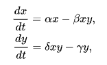

# Deep learning for model discovery
Harvard AM205 Final course project

### Requirements
This project utilises the [DeepMoD library](https://phimal.github.io/DeePyMoD/)
```
$ pip intsall deepymod
```

### Lotka Voltera

The Lotka–Volterra equations, also known as the predator–prey equations, are a pair of first-order nonlinear differential equations, frequently used to describe the dynamics of biological systems in which two species interact, one as a predator and the other as prey [Wikipedia](https://en.wikipedia.org/wiki/Lotka%E2%80%93Volterra_equations)



Now let's imagine that we do not know the specific dynamics of such a model:
